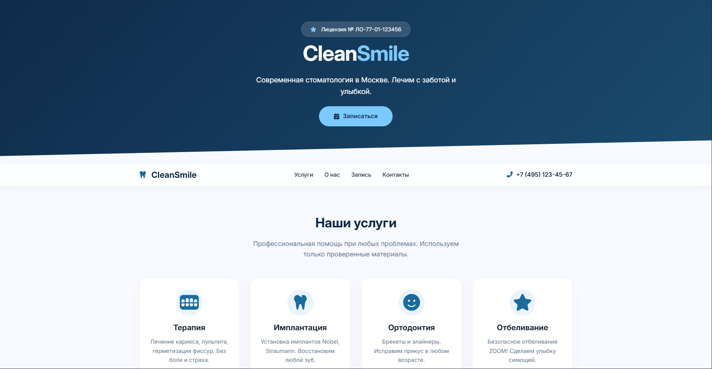
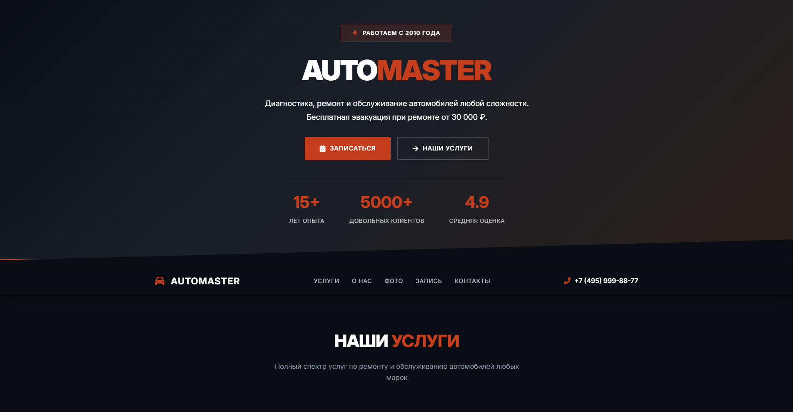
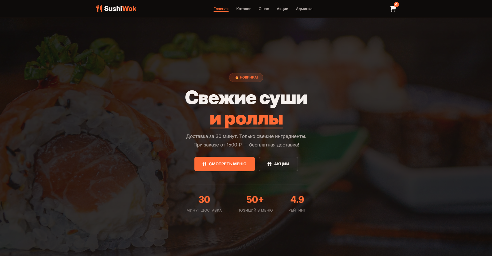

<div align="center">

# 🎯 Web Works

### Портфолио веб-разработчика • Web Developer Portfolio

[]()
[]()
[]()

**3 сайта. 3 разных стиля. Полный фарш.** • **3 sites. 3 different styles. Full package.**

</div>

---

## 📖 О проекте • About

**Русский:**  
Web Works — это моё портфолио, в котором собраны три полностью рабочих сайта для разных сфер. Каждый проект демонстрирует уникальный подход к дизайну, анимациям и функциональности. От светлой стоматологии до тёмного автосервиса и полноценного суши-ресторана с админкой.

**English:**  
Web Works is my portfolio featuring three fully functional websites for different industries. Each project demonstrates a unique approach to design, animations, and functionality. From a light dental clinic to a dark auto service and a full-featured sushi restaurant with an admin panel.

---

## 📸 Скриншоты • Screenshots

<div align="center">

| 🦷 Стоматология • Dental | 🚗 Автосервис • Auto Service | 🍣 Суши-ресторан • Sushi |
|--------------------------|------------------------------|--------------------------|
|  |  |  |

</div>

---

## 📁 Проекты • Projects

### 🦷 CleanSmile — Сайт стоматологии

| 🇷🇺 Русский | 🇬🇧 English |
|-------------|------------|
| 🏥 Светлый минималистичный дизайн | 🏥 Light minimalist design |
| ✨ Плавные анимации при скролле | ✨ Smooth scroll animations |
| 📝 Форма записи с валидацией | 📝 Appointment form with validation |
| 📱 Полный адаптив | 📱 Fully responsive |

**[📂 Перейти в папку →](dental/)**

---

### 🚗 AutoMaster — Сайт автосервиса

| 🇷🇺 Русский | 🇬🇧 English |
|-------------|------------|
| ⚫ Тёмный брутальный стиль | ⚫ Dark brutal style |
| 🟠 Акцентный оранжевый цвет | 🟠 Orange accent color |
| 🖼️ Галерея работ с оверлеем | 🖼️ Work gallery with overlay |
| 🗺️ Интерактивная карта | 🗺️ Interactive map |
| 📊 Статистика в шапке | 📊 Header statistics |

**[📂 Перейти в папку →](auto/)**

---

### 🍣 SushiWok — Сайт суши-ресторана

| 🇷🇺 Русский | 🇬🇧 English |
|-------------|------------|
| 🍣 Каталог с фильтрацией | 🍣 Catalog with filtering |
| 🛒 Корзина с подсчётом | 🛒 Shopping cart with calculation |
| 🔐 Админ-панель с защитой | 🔐 Admin panel with authentication |
| 📦 CRUD операции с товарами | 📦 CRUD product management |
| 💾 Хранение в localStorage | 💾 localStorage storage |
| 🌙 Тёмная тема со стеклом | 🌙 Dark theme with glass effect |

**[📂 Перейти в папку →](sushi/)**

---

## 🔑 Доступ к админке • Admin Access

**Только для SushiWok** • *Only for SushiWok*

| Поле • Field | Значение • Value |
|--------------|------------------|
| Логин • Username | `admin` |
| Пароль • Password | `admin123` |

---

## 🛠️ Технологии • Tech Stack

<div align="center">

| Технология | Для чего • Purpose |
|------------|-------------------|
| **HTML5** | Семантическая разметка • Semantic markup |
| **CSS3** | Анимации, адаптив, темы • Animations, responsive, themes |
| **JavaScript (ES6+)** | Интерактивность, логика • Interactivity, logic |
| **Yandex Maps API** | Интерактивные карты • Interactive maps |
| **localStorage** | Хранение данных • Data storage |
| **Font Awesome** | Иконки • Icons |
| **Google Fonts** | Шрифты • Typography |

</div>

---

## ✨ Общие возможности • Common Features

| 🇷🇺 Русский | 🇬🇧 English |
|-------------|------------|
| 🎯 Адаптив под все устройства | 🎯 Fully responsive |
| 🎨 Современный дизайн | 🎨 Modern design |
| ⚡ Плавные анимации | ⚡ Smooth animations |
| 🔄 Плавный скролл | 🔄 Smooth scrolling |
| 🌍 Чистый код без фреймворков | 🌍 Pure code without frameworks |
| 📱 Mobile First подход | 📱 Mobile First approach |

---

## 🚀 Как использовать • How to use

### 🇷🇺 Пошаговая инструкция

1. **Скачай** репозиторий или клонируй через Git
2. **Выбери** папку с нужным проектом (`dental/`, `auto/` или `sushiwok/`)
3. **Открой** `index.html` в браузере (Chrome, Edge, Firefox)
4. **Для SushiWok:** зайди в админку (`admin.html`) и войди под `admin / admin123`
5. **Наслаждайся!** 🎉

### 🇬🇧 Step-by-step guide

1. **Download** the repository or clone it via Git
2. **Choose** the project folder (`dental/`, `auto/`, or `sushiwok/`)
3. **Open** `index.html` in your browser (Chrome, Edge, Firefox)
4. **For SushiWok:** go to the admin panel (`admin.html`) and log in with `admin / admin123`
5. **Enjoy!** 🎉

---

## 📦 Установка • Installation

```bash
# Клонируй проект • Clone the project
git clone https://github.com/yourusername/web-works.git

# Перейди в папку • Go to folder
cd web-works

# Открой нужный проект • Open the project you want
cd dental/ && open index.html
# или • or
cd auto/ && open index.html
# или • or
cd sushiwok/ && open index.html
```

---

## 🗺️ Настройка API ключей • API Key Setup

### Яндекс Карты • Yandex Maps

Для работы карт в проектах `auto/` и `sushiwok/`:

1. Перейди на [Яндекс.Карты для разработчиков](https://developer.tech.yandex.ru/)
2. Зарегистрируйся и создай приложение
3. Получи API-ключ
4. Замени `ваш-api-ключ` в файлах:

```html
<script src="https://api-maps.yandex.ru/2.1/?apikey=ВАШ_КЛЮЧ&lang=ru_RU" type="text/javascript"></script>
```

---

## 📂 Структура проекта • Project Structure

```
web-works/
├── README.md                # Этот файл • This file
├── LICENSE                  # Лицензия MIT • MIT License
├── dental/                  # 🦷 Стоматология • Dental
│   ├── index.html
│   ├── style.css
│   └── script.js
├── auto/                    # 🚗 Автосервис • Auto Service
│   ├── index.html
│   ├── style.css
│   ├── script.js
│   └── img/                 # Фото для сайта • Images
├── sushiwok/                # 🍣 Суши-ресторан • Sushi
│   ├── index.html
│   ├── catalog.html
│   ├── admin.html
│   ├── style.css
│   ├── script.js
│   └── img/                 # Фото для сайта • Images
└── screenshots/             # Скриншоты для README
    ├── dental-preview.png
    ├── auto-preview.png
    └── sushi-preview.png
```

---

## 📸 Где взять фото • Where to get images

Фотографии уже есть в папке каждого проекта, но также вы можете сделать их сами или использовать с различных сайтов.  
*Photos are already included in each project folder, but you can also take your own or use photos from various websites.*

---

## 🤝 Вклад • Contributing

Pull Request'ы приветствуются! Если хочешь улучшить проект:

1. Форкни репозиторий
2. Создай ветку (`git checkout -b feature/AmazingFeature`)
3. Закоммить изменения (`git commit -m 'Add some AmazingFeature'`)
4. Запушь в ветку (`git push origin feature/AmazingFeature`)
5. Открой Pull Request

---

## 📝 Лицензия • License

Распространяется под лицензией MIT. Смотри файл `LICENSE` для деталей.  
*Distributed under the MIT License. See `LICENSE` for more information.*

---

## 👤 Автор • Author

**Кирилл • Kirill**

- GitHub: [@kiru0real](https://github.com/kiru0real)
- Telegram: [@pufikreal](https://t.me/pufikreal)
- Email: itskiru@icloud.com

---

## 🙏 Благодарности • Acknowledgments

- [Unsplash](https://unsplash.com) — Бесплатные фото • Free photos
- [Pexels](https://pexels.com) — Бесплатные фото • Free photos
- [Font Awesome](https://fontawesome.com) — Иконки • Icons
- [Google Fonts](https://fonts.google.com) — Шрифты • Fonts
- [Yandex Maps API](https://developer.tech.yandex.ru/) — Карты • Maps

---

<div align="center">

**⭐ Если тебе понравились проекты — поставь звезду!**  
**⭐ If you like these projects — give it a star!**

</div>
